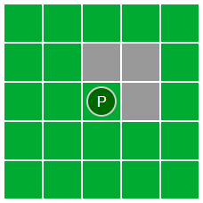

# How to Use This Project

There are a few ways to use the code in this repository:

## Software Architecture Learning Exercise
The code contains several versions of the same app, written and organized in different
ways to help illustrate the benefits of different techniques and patterns.

The recommended way to proceed is to start at version 0, read through the code to get
familiar with it, and then read the README for that file. There are coding exercises
below, and some specific to each version, that ask you to make enhancements to the app.
Feel free to complete these or just think through how they would be accomplished.

There are also some questions for each version that encourage you to think through
next steps for the application and how the current version might help or hinder them.

## TDD Katas
If you just want to practice doing some TDD, you should jump directly to version 2 since
it has a test file set up already. Use `npm test` to run the tests.

## Web App Practice Exercises
Pick basically any version and follow the exercise description to make the enhancements to the app.
You can pick a version that most closely resembles the web code you are used to working with.

# The App

The demo app used in all the exercises is a simple grid of tiles that could support a
game. The basic version has a player token that can move around with the arrow keys,
and "wall" tiles (colored gray) that cannot be moved through.

## Kata / Exercise Tasks
These tasks and additional features apply to any version:

   * Verify regular movement is bug free (can't move through walls, edge cases)
   * Increase the board size to 7 x 7
   * Add a monster or other content to a tile that also blocks movement 
     (note that walls use a class, the player is a child element. Use a child element for this exercise.)
   * Add movement points to the player and subtract one each time they move.
     Prevent them from moving if they don't have any left.
   * Add a square type similar to walls that doesn't block movement but instead
     costs two move points. Prevent movement if they don't have at least 2 left.
   * Add the ability to toggle an effect on the player that lets them ignore the
     more costly square type while active.

Questions
   * What would need to happen if you wanted to use a non-rectangular board?
   * What if I wanted to have two different maps with different tile types?
   * What if I wanted to save and load games?
   * What if I wanted to have an ascii-art console version and a mobile app 
     version that shared the same game?
